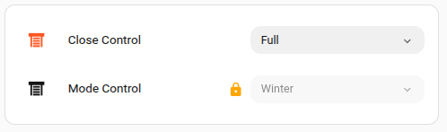

# Pill Select Input Row

A modern, Tile-card styled replacement for the default `input_select` row in Home Assistant. Designed specifically for use inside the **Entities Card**.

## Features
- **Pill Aesthetic**: Matches the modern Home Assistant "Tile" card look.
- **Collision Detection**: The dropdown automatically opens **upward** if it's too close to the bottom of the screen.
- **Locking Support**: Includes a lock toggle for security-sensitive selections.
- **Theme Native**: Automatically inherits your Home Assistant theme colors.
- **Customizable**: Set custom widths and active state colors via YAML.

## Installation

### HACS (Recommended)
1. Open **HACS** in Home Assistant.
2. Go to **Frontend**.
3. Click the **3-dot menu** in the top right and select **Custom repositories**.
4. Paste `https://github.com/ddpurdie/pill-select-input-row` into the URL and select **Plugin** as the category.
5. Click **Install**.

## Configuration
Add it to your Entities card like any other row:

### Configuration items

| Name             | Type         | Default                     | Description                                                        |
| ---------------- | ------------ | --------------------------- | ------------------------------------------------------------------ |
| entity           | string       |                             | A valid input_select entity_id                                     |
| name             | string/bool  | `friendly_name`             | Override entity friendly name (or `false` to hide)                 |
| icon             | string       |                             | Override the entities default icon                                 |
| width            | string       |                             | Specify the minium width of the selector. Either px or %           |
| locked           | bool         | `false`                     | When true, prevent the selection list from being shown. Will show lock symbol. The selection can be enabled by tapping the lock indicator |
| active_color     | string       |                             | CSS Color to apply to the icon if the state matches one of the `active_options` states |
| active_options   | string/array |                             | See `active_color'. May be a single string or an array of strings |

## Example



```yaml
type: entities
entities:
  - entity: input_select.shutterclosecontrol
    type: custom:pill-select-input-row
    name: Close Control
    icon: mdi:window-shutter
    width: 200px
    active_color: "#ff5722"
    active_options: [ Full, Auto]
  - entity: input_select.shuttermode
    type: custom:pill-select-input-row
    name: Mode Control
    width: 200px
    locked: true
```

   

